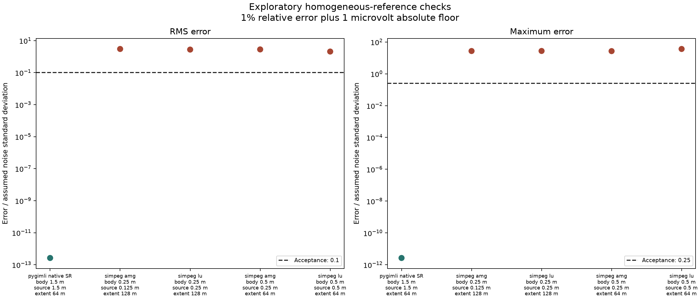

# First pilot run: inconclusive

The numerical profiles did not establish verified geometry discrimination. The finest tested SimPEG configuration failed the homogeneous-reference accuracy gate and exceeded the projected 12-hour bank budget. The full catalog and nuisance bank were not run.

This is a failure of the tested numerical configuration, not evidence that surface ERT cannot distinguish these geometries.

## Measurements from the profiles

Errors below are normalized by the common 1% relative-error plus 1 microvolt covariance. Acceptance requires RMS at most 0.1 and maximum at most 0.25.

| Solver | Body cell (m) | Source cell (m) | Extent (m) | RMS | Maximum | Projected bank (h) | Peak (GiB) |
| --- | --- | --- | --- | --- | --- | --- | --- |
| pygimli native SR | 1.5 | 1.5 | 64 | 2.63998e-13 | 2.66454e-12 | 0.143 | 0.717 |
| simpeg amg | 0.25 | 0.125 | 128 | 3.01602 | 26.9669 | 13.4 | 4.28 |
| simpeg lu | 0.25 | 0.25 | 128 | 2.76017 | 27.1941 | 6.39 | 7.13 |
| simpeg amg | 0.5 | 0.25 | 64 | 2.82745 | 26.6032 | 1.38 | 0.751 |
| simpeg lu | 0.5 | 0.5 | 64 | 2.0828 | 36.31 | 0.3 | 0.739 |

The finest SimPEG profile used 800,724 cells and 789,745 nodes. Its linear equation residuals were below 1e-10, while its continuum-reference errors remained much larger than the acceptance limits. An algebraically converged solve is not sufficient evidence of forward-model accuracy.

The pyGIMLi homogeneous check uses its analytical singularity-removal formulation. Passing that homogeneous case does not establish accurate sphere responses, convergence, or agreement with SimPEG. Four verified independent inclusion comparisons remain outstanding.

Coarse cell-center inclusion assignments also changed represented volume. The nominal sphere volume is about 14.137 cubic metres. The first 0.5 m SimPEG mesh represented 17 cubic metres. The fine source-refined mesh represented about 14.180 cubic metres for the profiled single sphere. Geometric volume agreement alone does not establish electrical accuracy.

## Scope of the record

These were exploratory numerical profiles during implementation, with one run per distinct profiled model. Timings are observations, not a speedup benchmark. The complete-bank estimate uses the mean of two inclusion solve times multiplied by 270 distinct normalized-background models. It excludes additional verification and plotting. That is a projection, not measured full-study runtime.

The observed fine-profile projection was approximately 13.4 hours, above the approved 12-hour cap. Its observed peak process memory remained below 8 GiB. Compute and numerical gates both prevent proceeding with that configuration.

All 144 planned pair/noise outcomes are recorded as not computed in pair-diagnostics.csv. Distances and classification errors are blank. The 810-state nuisance bank was not evaluated. There is no adaptive acquisition, material identification, hardware feasibility, or field mapping result.

The data-generation physics can be rerun using the published mesh flags and pinned dependencies. Exploratory records predate the final reporting and gate code. Exact runtimes and last-bit floating-point values are not promised across machines. The report generator checks the stored numerical metrics against the raw voltage arrays and frozen manifest.

## Verification and limitations

The scientific unit and solver smoke checks cover units, polarity, reciprocity, equal-volume geometry definitions, manifest uniqueness, background-resistivity scaling, and explicit failure accounting. Smoke-check tolerances do not replace the stricter pilot verification thresholds.

An electrode-node placement issue found in a coarse pyGIMLi smoke test was fixed by retaining all exact electrode coordinates in the independent grid. The published pyGIMLi profile used a 1.5 m grid that already contained those coordinates. No acceptance threshold was relaxed.

No fundamental observability conclusion follows from this stop. The cause of the remaining continuum-reference error has not been isolated completely. Discretization and remote-boundary grading need a separate validation study before interpreting small anomaly responses.

## Next decision

Pause the full bank. Review the proposed validation-only specification before more experiments. Keep the original physical assumptions and accuracy thresholds. Revisit the bank scope or its cost only after numerical validity is demonstrated.
